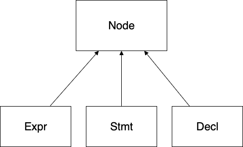
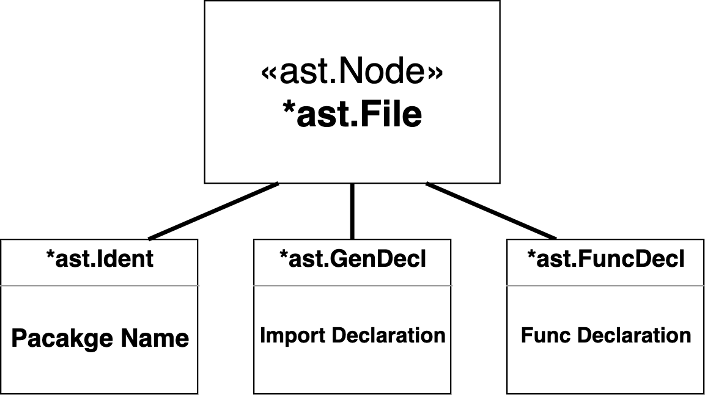
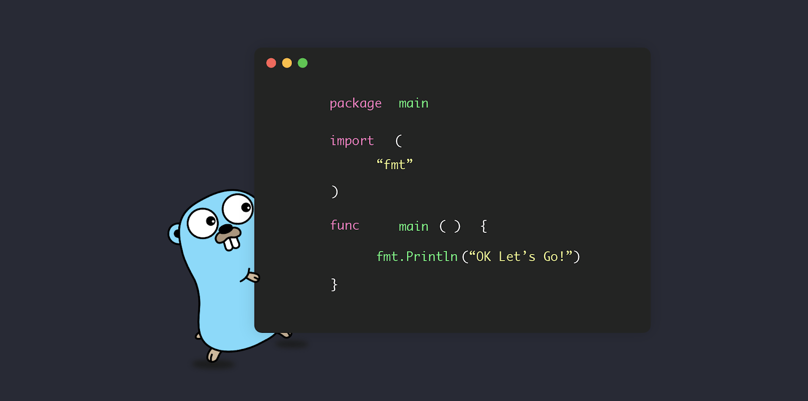

### [Take a walk down the AST tree](https://nakabonne.dev/posts/take-a-walk-the-go-ast/)

3 main interfaces that implement [ast](https://pkg.go.dev/go/ast) . [Node](https://pkg.go.dev/go/ast#Node):

<div align="center">
  
</div>

1. [ast.Expr](https://pkg.go.dev/go/ast#Expr) — representing expressions and types node
2. [ast.Stmt](https://pkg.go.dev/go/ast#Stmt) — representing statement node
3. [ast.Decl](https://pkg.go.dev/go/ast#Decl) — representing declaration node

<div align="center">
  
</div>

### Hello World

<div align="center">
  
</div>


#### Package Name
ast.Ident
```bash
*ast.Ident {
.  NamePos: dummy.go:1:9
.  Name: "hello"
}
```

#### Import Declarations
ast.GenDecl
```bash
*ast.GenDecl {
.  TokPos: dummy.go:3:1
.  Tok: import
.  Lparen: -
.  Specs: []ast.Spec (len = 1) {
.  .  0: *ast.ImportSpec {/* Omission */}
.  }
.  Rparen: -
}
```

ast.ImportSpec (single import declaration)
```bash
*ast.ImportSpec {
.  Path: *ast.BasicLit {/* Omission */}
.  EndPos: -
}
```

ast.BasicLit (literal of basic type)
```bash
*ast.BasicLit {
.  ValuePos: dummy.go:3:8
.  Kind: STRING
.  Value: "\"fmt\""
}
```
NOTE type of token: token.INT, token.FLOAT, token.IMAG, token.CHAR, or token.STRING

#### Function Declarations
ast.FuncDecl
```bash
*ast.FuncDecl {
.  Name: *ast.Ident {/* Omission */}
.  Type: *ast.FuncType {/* Omission */}
.  Body: *ast.BlockStmt {/* Omission */}
}
```

ast.Ident
```bash
*ast.Ident {
.  NamePos: dummy.go:5:6
.  Name: "greet"
.  Obj: *ast.Object {
.  .  Kind: func
.  .  Name: "greet"
.  .  Decl: *(obj @ 0)
.  }
}
```

ast.FuncType
```bash
*ast.FuncType {
.  Func: dummy.go:5:1
.  Params: *ast.FieldList {/* Omission */}
}
```

ast.FieldList
```bash
*ast.FieldList {
.  Opening: dummy.go:5:11
.  List: nil
.  Closing: dummy.go:5:12
}
```

ast.BlockStmt
```bash
*ast.BlockStmt {
.  Lbrace: dummy.go:5:14
.  List: []ast.Stmt (len = 1) {
.  .  0: *ast.ExprStmt {/* Omission */}
.  }
.  Rbrace: dummy.go:7:1
}
```
ast.BlockStmt node represents a braced statement list

ast.ExprStmt
```bash
*ast.ExprStmt {
.  X: *ast.CallExpr {/* Omission */}
}
```

ast.CallExpr
```bash
*ast.CallExpr {
.  Fun: *ast.SelectorExpr {/* Omission */}
.  Lparen: dummy.go:6:13
.  Args: []ast.Expr (len = 1) {
.  .  0: *ast.BasicLit {/* Omission */}
.  }
.  Ellipsis: -
.  Rparen: dummy.go:6:28
}
```
represents an expression that calls a function


ast.SelectorExpr
```bash
*ast.SelectorExpr {
.  X: *ast.Ident {
.  .  NamePos: dummy.go:6:2
.  .  Name: "fmt"
.  }
.  Sel: *ast.Ident {
.  .  NamePos: dummy.go:6:6
.  .  Name: "Println"
.  }
}
```

ast.BasicLit
```bash
*ast.BasicLit {
.  ValuePos: dummy.go:6:14
.  Kind: STRING
.  Value: "\"OK Let's Go!\""
}
```

### ASTmania

    - [AST Traversal](https://www.zupzup.org/go-ast-traversal/index.html)
    - [ASTs in Go](https://blog.bradleygore.com/2022/04/18/ast-in-go-p1/)
    - [GothamGo 2016 - How to write your own Go tool](https://www.youtube.com/watch?v=oxc8B2fjDvY)
    - [Metaprogramming with Go](https://dev.to/hlubek/metaprogramming-with-go-or-how-to-build-code-generators-that-parse-go-code-2k3j)
  
<div align="center">
  
</div>
<p align="center">
    
</p>
<p align="right">(<a href="#top">back to top</a>)</p>