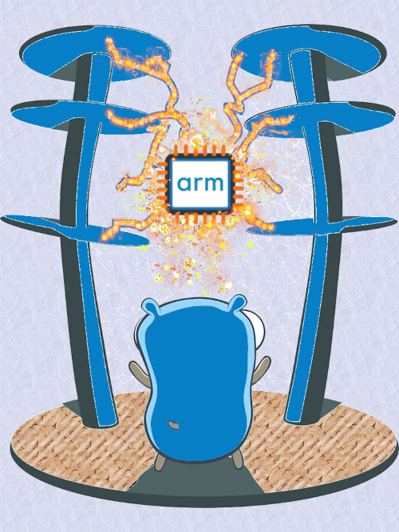

# `gARM彡` (´⊙o⊙`)♨
## Advanced ARM64 Compiler for High-Performance on the GO

    

`gARM彡` is a compiler for ARM64 assembly combining Go's simplicity with low-level control and high performance. Offering optimizations, hardware-level tuning, security controls, debugging tools, and more for the avid hacker.
We love our gopher more than anything it's always been a loyal companion protecting and providing us.

## Workspace `(。O ⩊ O。)っ`

### vscode extensions
- [ARM64 Instruction Reference](https://marketplace.visualstudio.com/items?itemName=whiteout2.arm64)
- [ARM Assembly Editor support](https://marketplace.visualstudio.com/items?itemName=Mikhail-Arkhipov.armassemblyeditor)
- [ARM Assembly syntax support](https://marketplace.visualstudio.com/items?itemName=dan-c-underwood.arm)
- [ARM64 Snippets](https://marketplace.visualstudio.com/items?itemName=drewmrk.arm64-assembly-snippets)
- [Hex Editor](https://marketplace.visualstudio.com/items?itemName=ms-vscode.hexeditor)

## Documentation `Σ(°△°)ꪱꪱ`

𒇫 [ARM assembly 101/](docs/asm/0_intro.md)
𒇫 [Links/](docs/links.md)

## `૮( OᴗO)っ` Philosophy

While there are many Go compilers and ARM assemblers, there's a gap in the market for tools that specifically optimize Go code for ARM's unique features such as:

- ARM's flexible second operand in arithmetic instructions
- Conditional execution capabilities
- NEON SIMD operations for vectorization
- Hardware divide and multiply-accumulate instructions

### Engineering Merit

- Go's AST parsing ensures robust handling of syntax
- intermediate representation (IR) allows for platform-independent optimizations
- maintainable code base (AST), (IRNodeMapper), (Optimizer), (AssemblyGenerator)
- gARM彡 by default compiles with Generational GC 

### Market Timing 

With the rising dominance of ARM architecture (Apple M-series, AWS Graviton, mobile devices, embedded systems), having tools that can optimize specifically for ARM64 is becoming increasingly important.

## `ദ്ദി(˵•̀ᴗ -˵)ᕤ` Road map

- Offer choice between [GC algoritms](docs/gc.md) or none
- High-performance computing on ARM servers (5x go performance on ARM64)
- Cross platform mobile / embedded systems where performance is critical
- cloud applications running on ARM instances

## Performance `(๑•̀ᗝ•́)૭` 

𒇫 todo 

## Contribute `ദ്ദി(༎ຶ‿༎ຶ)` 

𒇫 todo 

        

(<a href="#top">back to top</a>)
